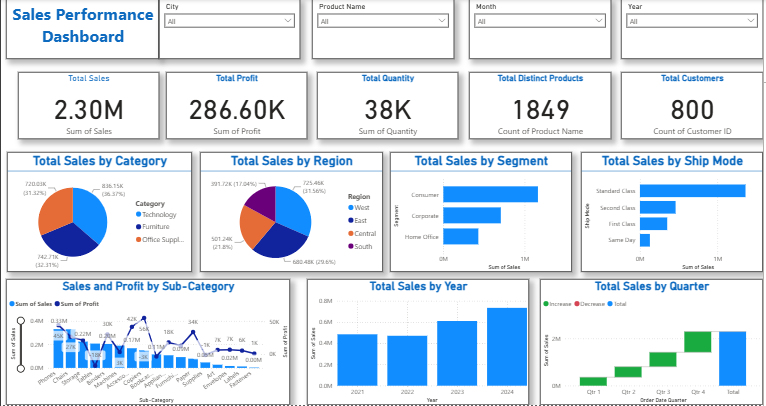

# 📊 Sales Performance Dashboard | Power BI

## 📌 Project Overview

This project is an interactive **Sales Performance Dashboard** developed using **Microsoft Power BI**. It provides a comprehensive analysis of sales performance using the Superstore dataset through interactive visualizations, KPIs, and filters.

The dashboard helps users analyze sales trends, customer behavior, regional performance, product categories, and profitability to support better business decisions.

---

## 📂 Dataset

- **Dataset:** Sample Superstore Dataset
- **Source:** Kaggle
- **Format:** CSV

---

## 🛠️ Tools & Technologies

- Microsoft Power BI
- Power Query
- DAX
- Data Visualization
- Data Modeling

---

## 📊 Dashboard Features

### KPI Cards

- 💰 Total Sales
- 📈 Total Profit
- 📦 Total Quantity Sold
- 🛒 Total Distinct Products
- 👥 Total Customers

### Visualizations

- 📊 Total Sales by Category
- 🌍 Total Sales by Region
- 👥 Total Sales by Segment
- 🚚 Total Sales by Ship Mode
- 📈 Sales and Profit by Sub-Category
- 📅 Total Sales by Year
- 📊 Total Sales by Quarter (Waterfall Chart)

### Interactive Filters

- City
- Product Name
- Month
- Year

---

# 📷 Dashboard Preview



---

## 📈 Key Business Insights

- Technology generated the highest sales among all product categories.
- The West region recorded the highest sales performance.
- Consumer customers contributed the largest share of total sales.
- Standard Class was the most frequently used shipping mode.
- Sales showed consistent growth over the years.
- Some product sub-categories generated high sales but relatively lower profits, highlighting opportunities to improve profitability.

---

## 📁 Project Structure

```text
Sales-Performance-Dashboard-PowerBI/
│
├── Sales_Performance_Dashboard.pbix
├── README.md
└── images/
    └── dashboard_overview.PNG
```

---

## 🎯 Learning Outcomes

Through this project, I gained hands-on experience in:

- Importing and transforming data using Power Query
- Creating interactive dashboards in Power BI
- Designing KPI cards
- Building bar, pie, line, and waterfall charts
- Using slicers for dynamic filtering
- Presenting business insights through visual analytics

---

## 🚀 Future Improvements

- Add Profit Margin KPI
- Add Monthly Profit Trend
- Include Customer Segmentation Analysis
- Create Drill-through Pages
- Publish the dashboard to Power BI Service

---

## 🎯 Conclusion

This dashboard demonstrates how Power BI can transform raw business data into meaningful insights using interactive visualizations and KPI tracking. It enables users to monitor sales performance, identify trends, and support data-driven decision-making.

---

## 👩‍💻 Author

**Bushra Naseem**

**GitHub:** https://github.com/bushranaseem1

**LinkedIn:** https://www.linkedin.com/in/bushra-naseem-b31776333/
